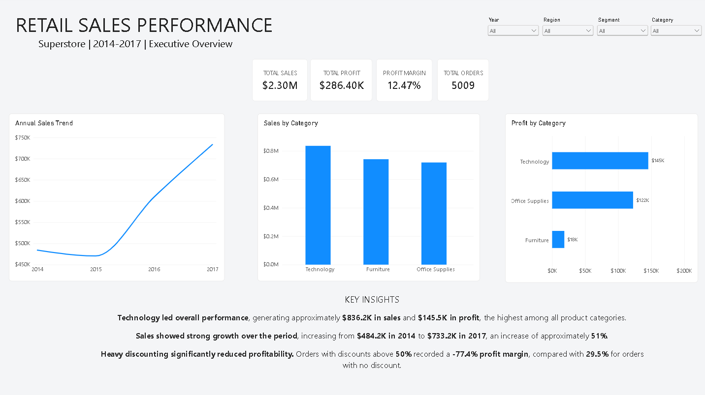
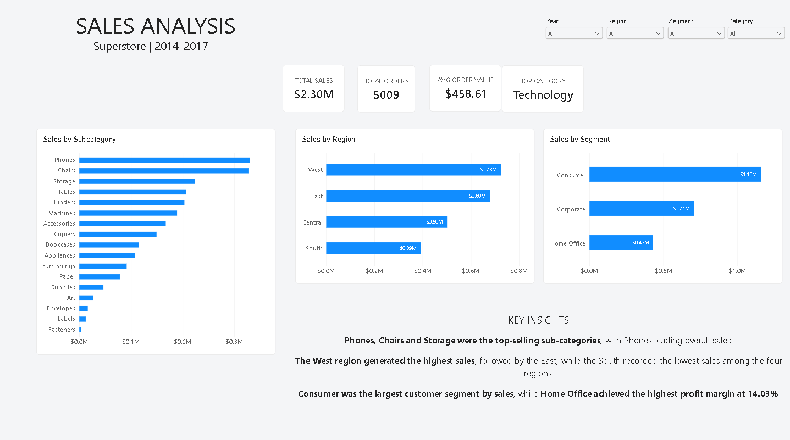
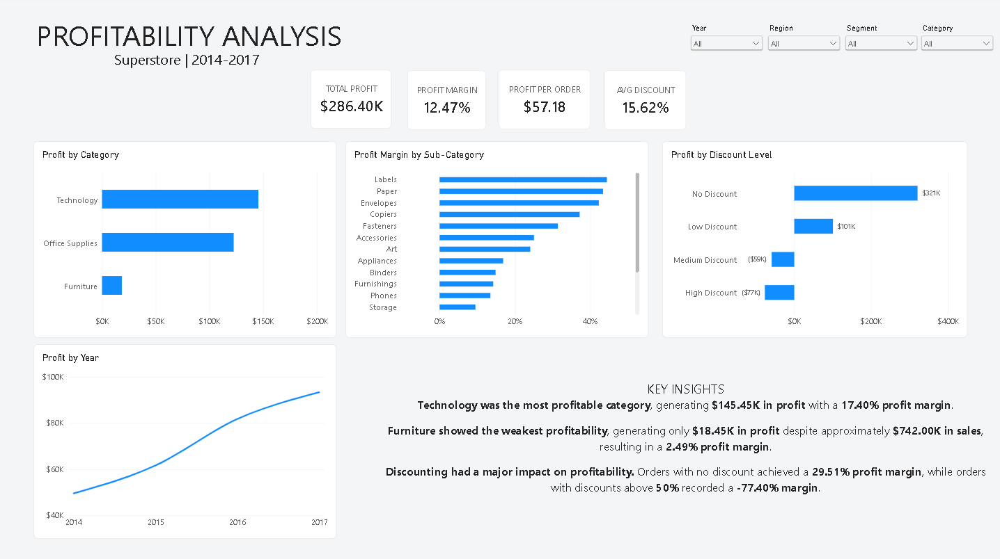
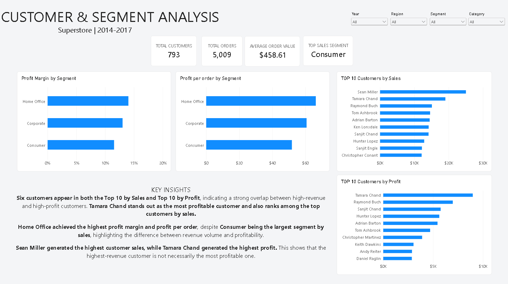
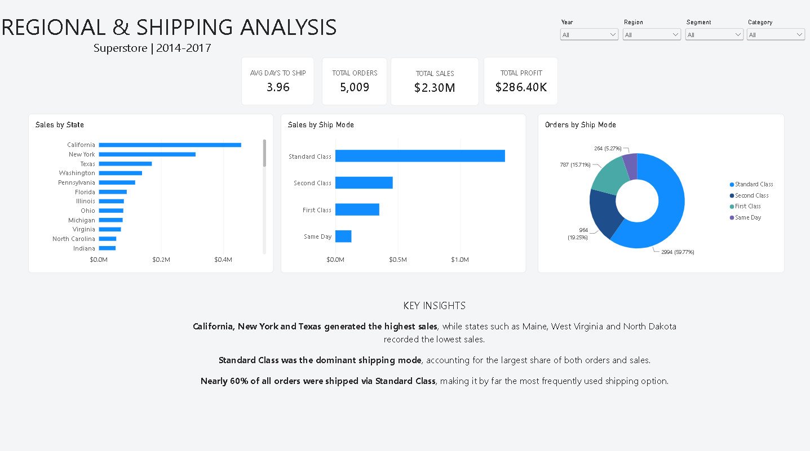

# Retail Sales Analysis

## Project Overview

This project analyzes the Sample Superstore dataset to identify sales trends, profitability patterns, customer behavior, product performance, regional performance, and the impact of discounts on profitability.

The analysis was conducted using PostgreSQL for data exploration and business analysis. The results will also be used to develop an interactive Power BI dashboard.

## Tools

- PostgreSQL
- SQL
- Power BI
- Visual Studio Code
- GitHub

## Analysis Structure

The project is divided into the following areas:

1. Exploratory Data Analysis
2. Executive Summary
3. Sales Analysis
4. Profit Analysis
5. Customer Analysis
6. Product Analysis
7. Regional Analysis
8. Discount Analysis

## Key Performance Indicators

| KPI | Result |
|---|---:|
| Total Sales | $2.297.200,86 |
| Total Profit | $286.397,02 |
| Profit Margin | 12.47% |
| Total Orders | 5.009 |
| Average Order Value | $458,61 |

## Sales Analysis

### Sales by Category

| Category | Total Sales |
|---|---:|
| Technology | $836.154,03 |
| Furniture | $741.999,80 |
| Office Supplies | $719.047,03 |

Technology was the highest-performing product category, generating approximately **$836.2K in sales**.

### Year-over-Year Sales Performance

| Year | Total Sales | YoY Growth |
|---:|---:|---:|
| 2014 | $484.247,50 | - |
| 2015 | $470.532,51 | -2.83% |
| 2016 | $609.205,60 | +29.47% |
| 2017 | $733.215,26 | +20.36% |

Sales declined slightly in 2015 before recovering strongly in 2016. Sales increased by **29.47% in 2016** and a further **20.36% in 2017**.

Overall, annual sales increased from approximately **$484.2K in 2014 to $733.2K in 2017**.

### Shipping Preferences

Standard Class was the most frequently used shipping mode, with **2.994 orders**, representing approximately **59.8% of all orders**.

## Profit Analysis

The profit analysis investigates which categories, subcategories, products, and customer segments contribute most to profitability and identifies areas generating losses.

### Profit by Category

| Category | Total Profit |
|---|---:|
| Technology | $145.454,95 |
| Office Supplies | $122.490,80 |
| Furniture | $18.451,27 |

**Key Insight:**  

Technology had the highest profit ($145.5K), followed by Office Supplies ($122.5K), while Furniture generated significantly less ($18.5K).

### Profit by Subcategory

| Subcategory | Total Profit |
|---|---:|
| Copiers | $55.617,82 |
| Phones | $44.515,73 |
| Accessories | $41.936,64 |
| Paper | $34.053,57 |
| Binders | $30.221,76 |
| Chairs | $26.590,17 |
| Storage | $21.278,83 |
| Appliances | $18.138,01 |
| Furnishings | $13.059,14 |
| Envelopes | $6.964,18 |
| Art | $6.527,79 |
| Labels | $5.546,25 |
| Machines | $3.384,76 |
| Fasteners | $949,52 |
| Supplies | -$1.189,10 |
| Bookcases | -$3.472,56 |
| Tables | -$17.725,48 |

**Key Insight:**  

Copiers generated the highest total profit at $55.6K followed by Phones and Accessories. In contrast, Tables generated the largest loss at $17.7K while Bookcases and Supplies also reported negative profitability. This indicates that profitability varies considerably across subcategories and highlights specific areas that may require further investigation.

### Profit Margin by Category

Profit margin was calculated using:

```text
(Total Profit / Total Sales) × 100
```

| Category | Total Sales | Total Profit | Profit Margin |
|---|---:|---:|---:|
| Technology | $836.154,03 | $145.454,95 | 17.40% |
| Office Supplies | $719.047,03 | $122.490,80 | 17.04% |
| Furniture | $741.999,80 | $18.451,27 | 2.49% |

**Key Insight:**  

Technology generated the highest total profit ($145.5K), the highest total sales ($836.2K), and the highest profit margin (17.40%). Office Supplies followed closely, with a profit margin of 17.04%. Furniture had the lowest profitability, with a profit margin of only 2.49%.


### Most Profitable Products

| Product | Total Sales | Total Profit | Profit Margin |
|---|---:|---:|---:|
| Ativa V4110MDD Micro-Cut Shredder | $7.699,89 | $3.772,95 | 49.00% |
| Zebra ZM400 Thermal Label Printer | $6.965,70 | $3.343,54 | 48.00% |
| Canon imageCLASS 2200 Advanced Copier | $61.599,82 | $25.199,93 | 40.91% |
| Plantronics Savi W720 Multi-Device Wireless Headset System | $9.367,29 | $3.696,28 | 39.46% |
| Canon PC1060 Personal Laser Copier | $11.619,83 | $4.570,93 | 39.34% |
| Hewlett Packard LaserJet 3310 Copier | $18.839,69 | $6.983,88 | 37.07% |
| Fellowes PB500 Electric Punch Plastic Comb Binding Machine with Manual Bind | $27.453,38 | $7.753,04 | 28.24% |
| 3D Systems Cube Printer. 2nd Generation, Magenta | $14.299,89 | $3.717,97 | 26.00% |
| HP Designjet T520 Inkjet Large Format Printer - 24" Color | $18.374,90 | $4.094,98 | 22.29% |
| Ibico EPK-21 Electric Binding System | $15.875,92 | $3.345,28 | 21.07% |


**Key Insight:**  

The products with the highest sales are not necessarily the most profitable, highlighting the importance of analyzing profit alongside revenue.

The Canon imageCLASS 2200 Advanced Copier generated the highest total profit ($25.2K), while the Ativa V4110MDD Micro-Cut Shredder achieved the highest profit margin (49.00%). In contrast, the Ibico EPK-21 Electric Binding System had the lowest profit margin among the top 10 most profitable products (21.07%).


### Products Generating the Largest Losses

| Product | Total Sales | Total Profit | Profit Margin |
|---|---:|---:|---:|
| Eureka Disposable Bags for Sanitaire Vibra Groomer I Upright Vac | $1,62 | -$4,47 | -275.00% |
| Bush Westfield Collection Bookcases, Dark Cherry Finish, Fully Assembled | $90,88 | -$190,85 | -210.00% |
| Euro Pro Shark Stick Mini Vacuum | $170,74 | -$325,63 | -190.71% |
| Okidata B401 Printer | $179,99 | -$251,99 | -140.00% |
| Zebra GK420t Direct Thermal/Thermal Transfer Printer | $703,71 | -$938,28 | -133.33% |
| GBC Plasticlear Binding Covers | $68,88 | -$68,42 | -99.33% |
| Brother MFC-9340CDW LED All-In-One Printer, Copier Scanner | $341,99 | -$319,19 | -93.33% |
| Epson TM-T88V Direct Thermal Printer - Monochrome - Desktop | $1212,71 | -$1057,23 | -87.18% |
| Epson Perfection V600 Photo Scanner | $206,99 | -$172,49 | -83.33% |
| GBC VeloBinder Electric Binding Machine | $496,02 | -$411,33 | -82.93% |

**Key Insight:**

The products generating the largest losses show substantial negative profit margins. 

The Eureka Disposable Bags for Sanitaire Vibra Groomer I Upright Vac had the highest negative profit margin (-275.00%), while the Epson TM-T88V Direct Thermal Printer generated the largest absolute loss among the listed products (-$1.06K).


### Profit by Customer Segment

| Customer Segment | Total Sales | Total Profit | Profit Margin |
|---|---:|---:|---:|
| Consumer | $1.161.401,35 | $134.119,21 | 11.55% |
| Corporate | $706.146,37 | $91.979,13 | 13.03% |
| Home Office | $429.653,15 | $60.298,68 | 14.03% |

**Key Insight:**

The Consumer segment generated the highest total sales ($1.16M) and total profit ($134.12K). However, Home Office achieved the highest profit margin (14.03%), indicating greater profitability relative to sales. The Consumer segment, despite generating the most profit in absolute terms, had the lowest profit margin (11.55%).


## Customer Analysis

The customer analysis examines customer value, profitability, purchasing activity, average order value, and purchase frequency.

### Top Customers by Sales

The following table shows the top 10 customers ranked by sales.

| Customer | Total Sales |
|---|---:|
| Sean Miller | $25.043,05 |
| Tamara Chand | $19.052,22 |
| Raymond Buch | $15.117,34 |
| Tom Ashbrook | $14.595,62 |
| Adrian Barton | $14.473,57 |
| Ken Lonsdale | $14.175,23 |
| Sanjit Chand | $14.142,33 |
| Hunter Lopez | $12.873,30 |
| Sanjit Engle | $12.209,44 |
| Christopher Conant | $12.129,07 |

**Key Insight:**

Sean Miller generated the highest total sales among all customers, with $25.04K in sales. The top 10 customers show a concentration of sales among high-value customers, highlighting the importance of customer retention and relationship management.


### Top Customers by Profit

The following table shows the top 10 customers ranked by total profit generated.

| Customer | Total Profit |
|---|---:|
| Tamara Chand | $8.981,32 |
| Raymond Buch | $6.976,10 |
| Sanjit Chand | $5.757,41 |
| Hunter Lopez | $5.622,43 |
| Adrian Barton | $5.444,81 |
| Tom Ashbrook | $4.703,79 |
| Christopher Martinez | $3.899,89 |
| Keith Dawkins | $3.038,63 |
| Andy Reiter | $2.884,62 |
| Daniel Raglin | $2.869,08 |

**Key Insight:**

Six customers - Tamara Chand, Raymond Buch, Sanjit Chand, Hunter Lopez, Adrian Barton, and Tom Ashbrook - appear in both the Top 10 by Sales and Top 10 by Profit. This indicates that these customers are particularly valuable to the business, combining high sales volume with strong profitability. Tamara Chand stands out as the most profitable customer, while also ranking among the top customers by sales.


### Customers with the Most Orders

The following table shows the customers with the highest number of orders.

| Customer | Number of Orders |
|---|---:|
| Emily Phan | 17 |
| Patrick Gardner | 13 |
| Noel Staavos | 13 |
| Sally Hughsby | 13 |
| Chloris Kastensmidt | 13 |
| Erin Ashbrook | 13 |
| Zuschuss Carroll | 13 |
| Joel Eaton | 13 |
| Clay Ludtke | 12 |
| Anna Häberlin | 12 |

**Key Insight:**

Emily Phan placed the highest number of orders, with 17 purchases, while the remaining customers in the top 10 placed between 12 and 13 orders. Interestingly, none of these customers also appear among the top 10 customers by sales or profit, suggesting that purchase frequency does not necessarily translate into higher customer value. Further analysis of Average Order Value can help explain this difference.


### Average Order Value by Customer

Average Order Value (AOV) was calculated using:

```text
Customer Sales / Number of Orders
```

| Customer | Average Order Value |
|---|---:|
| Sean Miller | $5.008,61 |
| Tamara Chand | $3.810,44 |
| Tom Ashbrook | $3.648,91 |
| Grant Thornton | $3.117,07 |
| Becky Martin | $2.947,41 |
| Mitch Willingham | $2.626,94 |
| Raymond Buch | $2.519,56 |
| Christopher Conant | $2.425,81 |
| Peter Fuller | $2.265,72 |
| Christopher Martinez | $2.238,51 |

**Key Insight:** 

Sean Miller has the highest Average Order Value at $5.01K, indicating a high spend per order. Tamara Chand and Tom Ashbrook also show high AOVs, reinforcing their position as high-value customers. 


### Customer Purchase Frequency

Customers were grouped into the following categories based on the number of orders placed.

| Purchase Frequency | Number of Customers |
|---|---:|
| 1 order | 12 |
| 2–5 orders | 317 |
| 6–10 orders | 415 |
| More than 10 orders | 49 |

**Key Insight:**  

Most customers placed between 6 and 10 orders, with 415 customers in this group. A further 49 customers placed more than 10 orders, indicating a relatively strong base of repeat customers. Only 12 customers placed a single order, suggesting that the majority of customers made multiple purchases.


## Product Analysis

The product analysis evaluates which products and product groups drive sales, volume, and profitability.

### Top Products by Sales

| Product | Total Sales |
|---|---:|
| Canon imageCLASS 2200 Advanced Copier | $61.599,82 |
| Fellowes PB500 Electric Punch Plastic Comb Binding Machine with Manual Bind | $27.453,38 |
| Cisco TelePresence System EX90 Videoconferencing Unit | $22.638,48 |
| HON 5400 Series Task Chairs for Big and Tall | $21.870,58 |
| GBC DocuBind TL300 Electric Binding System | $19.823,48 |
| GBC Ibimaster 500 Manual ProClick Binding System | $19.024,50 |
| Hewlett Packard LaserJet 3310 Copier | $18.839,69 |
| HP Designjet T520 Inkjet Large Format Printer - 24" Color | $18.374,90 |
| GBC DocuBind P400 Electric Binding System | $17.965,07 |
| High Speed Automatic Electric Letter Opener | $17.030,31 |

**Key Insight:**  

The Canon imageCLASS 2200 Advanced Copier generated the highest sales, with **$61.60K**, significantly outperforming the second-ranked product ($27.45K). This indicates a strong concentration of sales among a small number of high-value products.


### Best-Selling Products by Quantity

| Product | Quantity Sold |
|---|---:|
| GBC Premium Transparent Covers with Diagonal Lined Pattern | 67 |
| Situations Contoured Folding Chairs, 4/Set | 64 |
| Chromcraft Round Conference Tables | 61 |
| Wilson Jones Turn Tabs Binder Tool for Ring Binders | 59 |
| Global Wood Trimmed Manager's Task Chair, Khaki | 59 |
| Kingston Digital DataTraveler 16GB USB 2.0 | 57 |
| Fellowes Officeware Wire Shelving | 55 |
| Global High-Back Leather Tilter, Burgundy | 54 |
| SAFCO Arco Folding Chair | 53 |
| Xerox 226 | 53 |

**Key Insight:**

The products with the highest sales volume were not necessarily the products generating the highest revenue. For example, the top-selling product by quantity was the GBC Premium Transparent Covers, with 67 units sold, highlighting the difference between sales volume and revenue contribution.


### Sales and Profit by Category

| Category | Total Sales | Total Profit | Profit Margin |
|---|---:|---:|---:|
| Technology | $836.154,03 | $145.454,95 | 17.40% |
| Furniture | $741.999,80 | $18.451,27 | 2.49% |
| Office Supplies | $719.047,03 | $122.490,80 | 17.03% |

**Key Insight:**  

Technology was the strongest-performing category, generating $836.15K in sales and $145.45K in profit, with a 17.40% profit margin. In contrast, Furniture generated $742.00K in sales but only $18.45K in profit, resulting in a much lower 2.49% margin.


### Sales and Profit by Subcategory

| Subcategory | Total Sales | Total Profit | Profit Margin |
|---|---:|---:|---:|
| Phones | $330.007,05 | $44.515,73 | 13.49% |
| Chairs | $328.449,10 | $26.590,17 | 8.10% |
| Binders | $203.412,73 | $30.221,76 | 14.86% |
| Tables | $206.965,53 | -$17.725,48 | -8.56% |
| Storage | $223.843,61 | $21.278,83 | 9.51% |
| Machines | $189.238,63 | $3.384,76 | 1.79% |
| Accessories | $167.380,32 | $41.936,64 | 25.05% |
| Copiers | $149.528,03 | $55.617,82 | 37.20% |
| Bookcases | $114.880,00 | -$3.472,56 | -3.02% |
| Appliances | $107.532,16 | $18.138,01 | 16.87% |
| Furnishings | $91.705,16 | $13.059,14 | 14.24% |
| Paper | $78.479,21 | $34.053,57 | 43.39% |
| Supplies | $46.673,54 | -$1.189,10 | -2.55% |
| Art | $27.118,79 | $6.527,79 | 24.07% |
| Envelopes | $16.476,40 | $6.964,18 | 42.27% |
| Labels | $12.486,31 | $5.546,25 | 44.42% |
| Fasteners | $3.024,28 | $949,52 | 31.40% |

**Key Insight:** 

Copiers achieved the highest profit among subcategories, generating $55.62K with a 37.20% profit margin. However, Tables generated $206.97K in sales while producing a loss of $17.73K, resulting in a -8.56% margin. This suggests that high sales volume does not necessarily translate into profitability.


### Average Unit Price by Subcategory

Average Unit Price was calculated using:

```text
Total Sales / Total Quantity Sold
```

| Subcategory | Average Unit Price |
|---|---:|
| Copiers | $639,01 |
| Machines | $430,09 |
| Tables | $166,77 |
| Chairs | $139,41 |
| Bookcases | $132,35 |
| Phones | $100,34 |
| Supplies | $72,14 |
| Storage | $70,88 |
| Appliances | $62,19 |
| Accessories | $56,24 |
| Binders | $34,05 |
| Furnishings | $25,74 |
| Envelopes | $18,19 |
| Paper | $15,16 |
| Art | $9,04 |
| Labels | $8,92 |
| Fasteners | $3,31 |

**Key Insight:**  

Copiers had the highest average unit price at $639,01, followed by Machines at $430,09. In contrast, Fasteners had an average unit price of only $3,31. This highlights substantial differences in product pricing and suggests that revenue can be driven either by high unit prices or by higher sales volumes.


## Regional Analysis

The regional analysis examines geographic differences in sales and profitability.

### Sales and Profit by Region

| Region | Total Sales | Total Profit |
|---|---:|---:|
| West | $725.457,82 | $108.418,45 |
| East | $678.781,24 | $91.522,78 |
| Central | $501.239,89 | $46.749,43 |
| South | $391.721,91 | $39.706,36 |

**Key Insight:** 

The West region was the strongest-performing region, generating the highest sales ($725.46K) and profit ($108.42K). The South region generated the lowest sales ($391.72K) and profit ($39.70K), indicating a significant performance gap between the strongest and weakest regions.


### States Generating the Largest Losses

| State | Total Profit |
|---|---:|
| Texas | -$25.729,36 |
| Ohio | -$16.971,38 |
| Pennsylvania | -$15.559,96 |
| Illinois | -$12.607,89 |
| North Carolina | -$7.490,91 |
| Colorado | -$6.527,86 |
| Tennessee | -$5.341,69 |
| Arizona | -$3.427,92 |
| Florida | -$3.399,30 |
| Oregon | -$1.190,47 |

**Key Insight:** 

Texas generated the largest loss, with $25,73K in negative profit, followed by Ohio (-$16.97K) and Pennsylvania (-$15.56K). These states represent the main contributors to regional losses and should be prioritized for further investigation into pricing, discounts, shipping costs, and product mix.


### Top States by Sales

| State | Total Sales |
|---|---:|
| California | $457.687,63 |
| New York | $310.876,27 |
| Texas | $170.188,05 |
| Washington | $138.641,27 |
| Pennsylvania | $116.511,91 |
| Florida | $89.473,71 |
| Illinois | $80.166,10 |
| Ohio | $78.258,14 |
| Michigan | $76.269,61 |
| Virginia | $70.636,72 |

**Key Insight:** 

California was the strongest state by sales, generating $457,69K, substantially outperforming New York ($310.87K). Texas ranked third in sales with $170,19K despite also being the state with the largest loss, highlighting that high sales volume does not necessarily translate into profitability.


## Discount Analysis

The discount analysis evaluates how pricing discounts relate to sales and profitability.

### Average Discount by Category

| Category | Average Discount |
|---|---:|
| Technology | 17.39% |
| Office Supplies | 15.73% |
| Furniture | 13.23% |

**Key Insight:** 

Technology had the highest average discount (17.39%), while Furniture had the lowest (13.23%).


### Profitability by Discount Level

Discounts were grouped into:

- No Discount
- Low Discount
- Medium Discount
- High Discount

For each group, average profit and profit margin were analyzed.

| Discount Level | Number of Orders | Average Profit | Profit Margin |
|---|---:|---:|---:|
| No Discount | 4.798 | $66,90 | 29.51% |
| Low Discount | 3.803 | $26,50 | 11.91% |
| Medium Discount | 460 | -$77,86 | -15.30% |
| High Discount | 933 | -$106,71 | -77.40% |

**Key Insight:** 

Higher discount levels can be strongly associated with lower profitability. While low discounts still generate positive returns, medium and high discounts result in negative profit margins. High discounts are particularly damaging, with a profit margin of -77.40%. This suggests that aggressive discounting can significantly erode profitability and should be carefully managed.


### Profit Margin by Discount Rate

Profit margins were evaluated across individual discount percentages to identify the levels at which profitability begins to decline.

| Discount Rate | Number of Orders | Average Profit | Profit Margin |
|---|---:|---:|---:|
| 0% | 4.798 | $66,90 | 29.51% |
| 10% | 94 | $96,06 | 16.61% |
| 15% | 52 | $27,29 | 5.15% |
| 20% | 3,657 | $24,70 | 11.82% |
| 30% | 227 | -$45,68 | -10.05% |
| 32% | 27 | -$88,56 | -16.50% |
| 40% | 206 | -$111,93 | -19.81% |
| 45% | 11 | -$226,65 | -45.45% |
| 50% | 66 | -$310,70 | -34.80% |
| 60% | 138 | -$43,08 | -89.46% |
| 70% | 418 | -$95,87 | -98.66% |
| 80% | 300 | -$101,80 | -180.03% |

**Key Insight:**

Profitability declines substantially as discount rates increase. Profit margins remain positive up to a 20% discount, but become negative from 30% onwards. The decline becomes particularly severe at higher discount rates, reaching a negative margin of -180.03% at an 80% discount. This indicates that discounts above 20% can significantly undermine profitability.


### Sales and Profit by Discount Rate

Sales and profit were compared across discount levels to determine whether higher discounts generate sufficient additional revenue to offset their impact on profitability.

| Discount Rate | Total Sales | Total Profit |
|---|---:|---:|
| 0% | $1.087.908,47 | $320.987,60 |
| 10% | $54.369,35 | $9.029,18 |
| 15% | $27.558,52 | $1.418,99 |
| 20% | $764.594,37 | $90.337,31 |
| 30% | $103.226,66 | -$10.369,28 |
| 32% | $14.493,46 | -$2.391,14 |
| 40% | $116.417,78 | -$23.057,05 |
| 45% | $5.484,97 | -$2.493,11 |
| 50% | $58.918,54 | -$20.506,43 |
| 60% | $6.644,70 | -$5.944,66 |
| 70% | $40.620,28 | -$40.075,36 |
| 80% | $16.963,76 | -$30.539,04 |

**Key Insight:**

Higher discount rates do not consistently generate sufficient additional sales to offset their impact on profitability. While discounts of up to 20% still generate positive profit, discounts of 30% or more consistently result in losses. The results suggest that aggressive discounting can increase sales volume without creating sustainable profitability.


## Power BI Dashboard

An interactive Power BI dashboard was developed to provide an overview of sales performance, profitability, customer behavior, product performance, regional results, and discount impact. Key KPIs include Total Sales, Total Profit, Profit Margin, Total Orders, Average Order Value, Discount Rate, and Profit per Order.

The dashboard is available in the project repository.

### Executive Overview



### Sales Analysis



### Profitability Analysis



### Customer & Segment Analysis



### Regional & Shipping Analysis




## Key Business Insights

- **Technology was the strongest-performing category**, generating the highest total sales ($836.15K), total profit ($145.45K), and profit margin (17.40%).

- **Furniture represents a profitability concern.** Despite generating $719.05K in sales, the category produced only $18.45K in profit, resulting in a profit margin of just 2.49%.

- **Profitability varies significantly across subcategories.** Copiers generated the highest total profit ($55.62K), while Tables generated a loss of $17.73K despite producing more than $206K in sales.

- **High sales volume does not necessarily translate into high profitability.** Texas, for example, generated $170.19K in sales but recorded the largest state-level loss of $25.73K.

- **Customer value is driven by more than purchase frequency.** Emily Phan placed the highest number of orders (17), but did not rank among the top customers by sales or profit. In contrast, customers such as Tamara Chand combined high sales with strong profitability.

- **A small group of customers contributes significant business value.** Six customers appeared in both the Top 10 by Sales and Top 10 by Profit, indicating a group of particularly valuable customers.

- **Sales performance improved strongly after 2015.** Annual sales increased by 29.47% in 2016 and a further 20.36% in 2017, reaching $733.22K.

- **Discounting has a strong negative relationship with profitability.** Orders without discounts achieved a 29.51% profit margin, compared with -15.30% for medium discounts and -77.40% for high discounts.

- **Discounts above 20% represent a significant profitability risk.** Profit margins remained positive at discount rates up to 20%, but became negative from 30% onwards.

- **Higher discounts did not consistently generate enough additional sales to compensate for lower margins.** Discount rates of 30% or more consistently resulted in negative total profit.

## Recommendations

- **Review discount policies** and avoid excessive discounts, particularly rates above 20%, unless they are supported by a clear strategic objective.

- **Prioritize profitable growth over sales volume.** Performance should be evaluated using both revenue and profitability rather than sales alone.

- **Investigate underperforming product groups**, particularly Tables, Bookcases, and Supplies, to identify issues related to pricing, costs, discounts, or product mix.

- **Review loss-making states**, especially Texas, Ohio, and Pennsylvania, to understand whether regional pricing, shipping costs, discounting, or product mix are contributing to negative profitability.

- **Focus on high-performing categories and subcategories**, particularly Technology, Copiers, Accessories, Paper, Labels, and Envelopes, while monitoring their sustainability and demand.

- **Develop targeted customer retention strategies** for high-value customers who generate both strong sales and profit.

- **Use targeted rather than broad discounting**, applying promotions selectively based on customer segment, product profitability, inventory levels, or strategic objectives.

- **Monitor discount performance continuously through Power BI**, tracking Sales, Profit, Profit Margin, Discount Rate, and Orders to identify when promotional activity begins to negatively affect profitability.

- **Use Average Order Value and purchase frequency together** when evaluating customer value, since frequent purchases do not necessarily indicate higher revenue or profitability.
